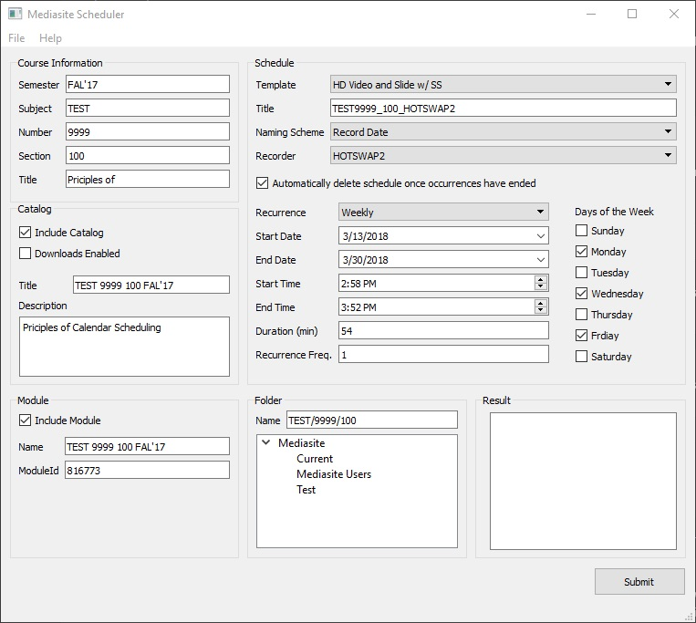

# Mediasite Scheduler

This application provides an alternative interface for creating single or multiple (batch) Mediasite schedules, folders, catalogs, and modules at once.

## Prerequisites

Before you get started, make sure to install or create the following prerequisites:

* Python 3.x: [https://www.python.org/downloads/](https://www.python.org/downloads/)
* Python Requests Library (non-native library used for HTTP requests): [http://docs.python-requests.org/en/master/](http://docs.python-requests.org/en/master/)
* PyQt5: [https://riverbankcomputing.com/software/pyqt/download5](https://riverbankcomputing.com/software/pyqt/download5)
* pytz: [https://github.com/newvem/pytz](https://github.com/newvem/pytz)
* tzlocal: [https://github.com/regebro/tzlocal](https://github.com/regebro/tzlocal)
* A Mediasite user with operations "API Access" and "Manage Auth Tickets" (configurable within the Mediasite Management Portal)
* A Mediasite API key: [https://&lt;your-hostname&gt;/mediasite/api/Docs/ApiKeyRegistration.aspx](https://&lt;your-hostname&gt;/mediasite/api/Docs/ApiKeyRegistration.aspx)

## Special Notes

Mediasite API documentation can be found at the following URL (change the bracketed area to your site-specific base domain name): [http://&lt;your-hostname&gt;/mediasite/api/v1/$metadata](http://&lt;your-hostname&gt;/mediasite/api/v1/$metadata)

The Mediasite API makes heavy use of the ODATA standard for some requests (including the demo performed within this repo). For more docuemntation on this standard reference the following URL: [http://www.odata.org/documentation/odata-version-3-0/url-conventions/#requestingdata](http://www.odata.org/documentation/odata-version-3-0/url-conventions/#requestingdata)

Special note: programmatic creation of Mediasite weekly recurrences using the Mediasite API have bugs that sometimes cause inconsistent views or creation of recordings. Because of this, "weekly" recurrences are created using calculated one-time dates and times. This results in the schedule looking slightly different but appearing and recording correctly as per user-provided entry.

## Usage

1. Ensure prerequisites outlined above are completed.
1. Fill in necessary information within config/sample_config.json and rename to project specifics
1. Remove the text "_sample" from all config file
1. Run main.py with Python 3.x

## Batch Imports

Batch imports can be performed using the File -> Batch Import... option. Imported data must be entered into CSV spreadsheet file (.csv) and follow a strict header convention which can be found within this repository under /examples/mediasite_scheduler_batch_import_example.csv

## License

MIT - See license.txt

## Notice

Mediasite Scheduler is made possible by open source software. Please see the following listing for software used and respective licensing information:

* Python 3 - PSF [https://docs.python.org/3/license.html](https://docs.python.org/3/license.html)
* Requests - Apache 2.0 [https://opensource.org/licenses/Apache-2.0](https://opensource.org/licenses/Apache-2.0)
* pytz - MIT [https://opensource.org/licenses/MIT](https://opensource.org/licenses/MIT)
* tzlocal - MIT [https://opensource.org/licenses/MIT](https://opensource.org/licenses/MIT)
* Qt 5 - LGPL 3.0 [https://opensource.org/licenses/LGPL-3.0](https://opensource.org/licenses/LGPL-3.0)
* PyQt 5 - GPL 3.0 [https://opensource.org/licenses/GPL-3.0](https://opensource.org/licenses/GPL-3.0)   
